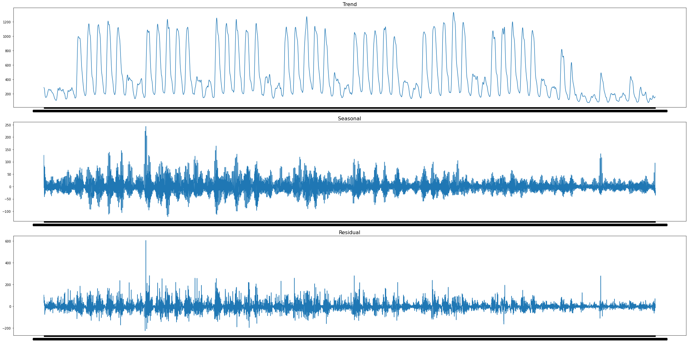
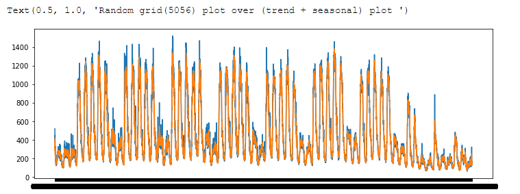
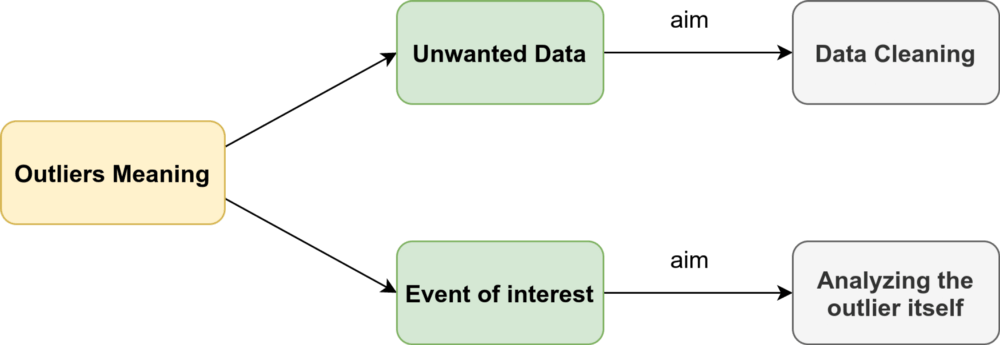

# Time-Series-Anomaly-Detection

# Introduction:

Anomaly detection is the process of discover the event or the points which are unexpected at 
this position of the dataset or deviates from the normal pattern of the dataset. 
So, the detection of those points very important; because it give us an early step to make the 
emergency movements to control that un usual change. 
We used many techniques to reach best one to apply it on our way of the project. 

# Dataset:
This dataset provides information about the telecommunication activity over the city of Milano. The dataset is the result of a computation over the Call Detail Records (CDRs) generated by the Telecom Italia cellular network over the city of Milano. CDRs log the user activity for billing purposes and network management.

-  [Milan dataset]( https://dataverse.harvard.edu/dataset.xhtml?persistentId=doi:10.7910/DVN/EGZHFV) 
-  [Article that describes the data: ]( https://www.nature.com/articles/sdata201555)
 
# Anomaly Detection Methods: 
The outlairs and anomaly detection different methods:
 - 1- Tukey’s box plot method.
 - 2- Isolation forest.
 - 3- Anomaly Detection with LSTM Autoencoders.
 - 4- Seasonal-Trend Decomposition.

## 1- Tukey’s box plot method

in this method we depend on the pox plot to determine if the point is outlier or not and not 
only that it gives us the ability to decide if this outlier is possible or probable outlier point; by 
calculate the following parameters: 
- 25th percentile (Q1) 
- 75th percentile (Q3) 
- interquartile range (IQR = Q3 – Q1) 
- Lower inner fence: Q1 – (1.5 * IQR) 
- Upper inner fence: Q3 + (1.5 * IQR) 
- Lower outer fence: Q1 – (3 * IQR) 
- Upper outer fence: Q3 + (3 * IQR) 

Then decide if the point between the inner fence and outer fence it considered as a possible 
outlier point. And if the point lies outside the outer fence, it will be considered as probable 
outlier. 

## 2- Isolation forest.
In this method we will depend on the detection using some Machine Learning algorithms. In the 
we will depend on Isolation Forest. 

One of those algorithms is the Isolation Forest method. Isolation Forest build using the decision 
trees which depend on the points that go deeper into the tree are not anomalies and points 
which go short distance have big probability to be anomalies, and it is unsupervised learning 
model which used without labeled data. 

The algorithm goes by selecting a sample of the dataset then branch it on the binary tress by 
setting a threshold if the sample we selected is less than this threshold it will be in the left 
branch and if it not it will be in the right branch. This process repeated until we every point in 
the dataset is isolated. 

## 3- Anomaly Detection with LSTM Autoencoders. 
In this method we will depend on the detection using the forecasting by Deep Learning 
algorithms. In the forecasting methods we depend on predict the next point with the addition 
of some noise and make comparison of this point and the true point at this timestamp by 
finding the difference between the two points then add threshold finally find the anomalies by 
compare the difference of the two points with this threshold (we used the Mean absolute error 
MAE). 

Autoencoders are type of self-supervised learning model which are a neural network that learn 
from the input data. We use autoencoder because the Principal Component Analysis (PCA), 
which we used in the previous method we depend on the linear algebra to do the models, but 
by using autoencoders we depended on the non-linear transformation like by use the activation 
functions; those non-linearity gives us the ability to go deep in the number of the neural 
network layers. 

Long Short-Term Memory (LSTM) is a type of artificial recurrent neural network (RNN). which 
are designed to handle sequential data, with the previous step's output being fed as the current 
step's input. 

We apply some dimensionality reduction on our dataset by use encoder to make the dimension 
small then use the decoder to get it back and that minimize the reconstruction loss. In fact, that 
will make us lose some information but it gives us the ability to know the main pattern of the 
information and thought that we could define any information out hits pattern under sone 
threshold will be outlier. 

To determine the cutoff point we use the Mean Absolute Error (MAE). We use the MAE 
because it so sensitive toward outliers. MAE find the mean absolute error between the actual 
value 𝑦 and predicted value 𝑦' of the dataset then find the threshold like the following : 

When we apply the threshold to the predicted values which will give us the anomalies at the 
points which corresponding to the locations of the signal which above the threshold line the 
previous graph, we get the following graph for the anomalies.

 ## 4- Seasonal-Trend Decomposition.
Now we will go to the final method which is decomposition. Signal decomposition aims to 
analysis our signal to its main three components Seasonal, trend and the residual (S, T, R). 
Seasonal is the signal component which contain the most rapidly pattern which occurs regular 
every cerin time. Trend contain the general shape of the data over the whole dataset and finally 
the residual is the rest of the signal after extract the seasonal and trend of it, it is in somehow a 
random part over the signal which indicate it.

To make the residual more obvious to us we will plot the signal with and without the residual 
component as the following: 

The residual will be our focus here, we will first analysis the signal to its main three component 
and take the residual to work on it. 
We will apply the model by define the threshold which depend on the he confidence interval, 
then apply it for the residual then decide if this point is an anomaly or not.

## What is next?
After determining the anomalies points what we should do about them? In the most common 
application like Microsoft anomaly detection, they have some web application to send some 
emails to the concerned persons about the sudden and didn’t expected change, then they take 
the right decision to solve this issue. 

But in our scope here we concerned with if this point is outlier or point of interest. 

So, if the point we detected as outlier is a data that we did not need we will do on it some 
cleaning data processing. But in the other hand some time did not mean if there is some 
unusual event that we didn’t need it. Some event most be important to us because might this 
event will happen in the future so by studying it will make us have the ability to avoid this 
sudden change in the future by handle it by some control flow process. 
Here we after studying those points we will make all anomalies point as a nan value so will 
handle it in the coming part, Missing value imputation. 

